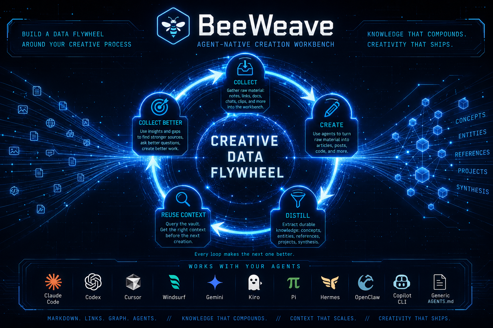

# 🐝 BeeWeave

[English](README.md) | [中文](README-zh.md) | [Documentation](https://ptonlix.github.io/beeweave/) | [中文文档](https://ptonlix.github.io/beeweave/zh/)

BeeWeave 是一个 **Agent 原生的创作工作台**。它围绕创作过程构建一个数据飞轮：获取素材，用 Agent 辅助创作，把关键内容沉淀成长期知识，再用这些知识指导下一轮更好的素材获取与创作。

<p align="center">
  <a href="https://deepwiki.com/ptonlix/beeweave"></a>
  <a href="https://github.com/ptonlix/beeweave/pulls"></a>
  <a href="https://x.com/Baird_cfd"></a>
  <a href="https://www.zhihu.com/people/baird-66"></a>
</p>

<p align="center">
  
</p>

<p align="center">
  <code>获取素材 -> 创作 -> 沉淀 -> 复用上下文 -> 获取更好的素材并创作新内容</code>
</p>

BeeWeave 的目标不只是“给 Agent 加记忆”。它提供的是一套结构化创作循环：`workbench/` 用来承载素材、草稿、捕获和资料库；`vault/` 用来存放稳定的 Markdown 知识；一组共享 skills 则帮助不同 Agent 在这个循环里推进素材、创作和沉淀，而不是把上下文困在某一次聊天、某一个代码库或某一个工具里。

## ✨ 为什么是 BeeWeave

- **创作数据飞轮**：先获取素材，再基于素材创作，把有价值的内容沉淀成长期知识，再复用这些知识指导下一轮素材获取和创作。
- **Workbench 优先**：`workbench/` 存放草稿、快速捕获、网页剪藏和原始资料，允许早期内容保持粗糙。
- **编译后的 Markdown Vault**：`vault/` 存放可复用知识层，包括 concepts、entities、references、projects、synthesis、metadata 和图谱友好的 wikilinks。
- **多 Agent 共享上下文**：Claude Code、Codex、Cursor、Gemini、Kiro、Hermes、OpenClaw、Pi、Copilot CLI，以及通用 `AGENTS.md` Agent 都可以使用同一个知识库。

底层知识组织模式受到 Andrej Karpathy 的 [LLM Wiki gist](https://gist.github.com/karpathy/442a6bf555914893e9891c11519de94f) 启发：把有用知识一次性编译成互相关联的 Markdown 文件，并持续更新，而不是在每次会话里重新发现同样的上下文。

## 🚀 快速开始

在你希望 BeeWeave 创建 `vault/` 和 `workbench/` 的目录里安装并运行 setup：

```bash
pip install beeweave
bwe setup
```

Setup 会做这些事：

1. 如果不存在，则创建 `./vault` 和 `./workbench`。
2. 写入全局配置 `~/.beeweave/config`。
3. 询问是否额外安装 advanced global skills。
4. 询问要为哪些 Agent 安装 BeeWeave skills 和 bootstrap 文件。
5. 为选中的 Agent 安装完整的项目本地 skills。
6. 为支持全局 skills 的 Agent 安装默认三项：`beeweave-update`、`beeweave-query`、`beeweave-ingest`。

Setup 过程中，你会先选择是否安装 optional advanced global skills，然后选择要安装到哪些 Agent。默认全局技能保持克制，完整 BeeWeave 技能集会安装到你选择的项目本地 Agent 目录中。

Setup 完成后，在 Agent 中直接使用：

```text
/beeweave-ingest workbench/inbox
/beeweave-query what do I know about rate limiting?
/beeweave-update
```

## 🤖 Agent 快速开始

如果你希望 Agent 从源码仓库驱动 setup，可以把仓库地址给它，并让它初始化 BeeWeave 工作台：

```text
https://github.com/ptonlix/beeweave - set up my BeeWeave workspace
```

Setup skill 位于 [.skills/wiki/beeweave-setup/SKILL.md](.skills/wiki/beeweave-setup/SKILL.md)。

## 🛠️ 常用命令

```bash
bwe info                                      # 查看版本、配置和安装路径
bwe list                                      # 列出内置 skills
bwe setup --agents claude,codex               # 为指定 Agent 安装
bwe setup --global-extra beeweave-capture     # 显式安装高级全局技能
```

卸载 BeeWeave skills 和配置：

```bash
bwe uninstall
```

卸载会移除 BeeWeave 管理的 skills、项目本地 bootstrap 文件和 `~/.beeweave` 配置，但不会删除你的 `vault/` 或 `workbench/` 内容。

## 🗂️ Runtime 目录结构

BeeWeave 把创作工作台和沉淀后的知识库分开：

```text
project/
+-- vault/                  # 稳定的 Markdown 知识库
|   +-- concepts/
|   +-- entities/
|   +-- skills/
|   +-- references/
|   +-- synthesis/
|   +-- projects/
|   +-- _meta/
|   +-- _archives/
|   +-- _staging/
|   +-- .obsidian/
+-- workbench/              # 素材、草稿和创作暂存区
    +-- inbox/
    |   +-- captures/
    |   +-- web/
    |   +-- archived/
    |   +-- rejected/
    +-- articles/
    |   +-- drafts/
    |   +-- published/
    +-- ppt/
    +-- library/
```

`workbench/` 用来存放粗糙笔记、网页剪藏、导入素材和草稿。`vault/` 用来存放稳定、可搜索、可链接、可复用的知识。`bwe setup` 会创建这些目录，并放置 `.gitkeep` 占位文件，确保第一次 ingest 前目录结构已经准备好。

外部第三方 skills 由 BeeWeave 管理在项目运行目录之外：

```text
~/.beeweave/external/
+-- repos/       # 克隆下来的源仓库
+-- skills/      # 按 skill 名称稳定暴露的入口
+-- manifest.json
```

使用 `bwe external install <source> --skill <name> --link-project .` 安装
一个外部 skill，并把它链接到当前项目的 Agent skill 目录中。对于包含
多个 skills 的仓库，请使用 `--skill` 或 `--path` 明确选择；BeeWeave
不会默认安装整个多 skill 仓库，除非你显式传入 `--all`。

## 🎯 Skill 安装策略

BeeWeave 有意减少全局安装的技能数量。

**默认全局安装**

- `beeweave-update`：把项目中的有用知识同步到 vault
- `beeweave-query`：从编译后的 vault 中回答问题
- `beeweave-ingest`：把素材处理成可长期保存的知识

**可选 advanced global skills**

- `beeweave-capture`：把当前会话发现保存到 inbox 或 vault
- `beeweave-context-pack`：为另一个任务打包 vault 上下文
- `beeweave-digest`：生成近期知识 digest
- `beeweave-status`：查看 ingest 状态和 vault 健康度
- `beeweave-memory-bridge`：按来源 Agent 比较知识

显式安装高级全局技能：

```bash
bwe setup --global-extra beeweave-capture,beeweave-status
```

其它 BeeWeave skills 默认保留在项目本地。这样可以保持其它项目干净，同时让 BeeWeave 工作台拥有完整能力。

## 🤝 支持的 Agent

`bwe setup` 支持这些 Agent：

```text
claude, cursor, windsurf, generic, pi, kiro, gemini, antigravity,
codex, hermes, openclaw, copilot, trae, trae-cn
```

项目本地 setup 会安装完整 skills 和 bootstrap 文件，例如 `AGENTS.md`、`CLAUDE.md`、`GEMINI.md`、`HERMES.md`、Cursor rules、Windsurf rules、Kiro steering、Antigravity rules/workflows 和 Copilot instructions。

全局 setup 只安装默认 portable global skills，以及你通过 `--global-extra` 选择的额外技能。

## 🔄 核心工作流

BeeWeave 是一个循环，而不是单向归档。每一轮循环都应该让下一轮变得更好：更好的素材选择、更清晰的草稿、更稳定的知识，以及更丰富的下一轮上下文。

### 1. 获取素材

先把原始输入收集到 `workbench/`：笔记、链接、PDF、聊天导出、会议记录、截图、产品 brief、源码文件，或者一次 Agent 会话中的快速发现。

常用入口：

```text
/beeweave-capture --quick
/beeweave-ingest workbench/inbox
```

这一阶段不要求内容完美。`workbench/inbox/` 可以保持粗糙，它是素材进入系统的入口层。之后这些素材可能变成文章、短内容、参考笔记或稳定概念。

### 2. 基于素材创作

把 `workbench/` 当作创作台。写作 skills 会帮助你把收集到的素材转化为具体输出，同时保留你的作者视角：

```text
Use beeweave-article-writer to draft a long-form article from these notes.
Use beeweave-social-writer to turn this finding into a thread.
```

创作阶段是素材真正开始产生价值的地方。草稿放在 `workbench/articles/drafts/`，资料放在 `workbench/library/` 或 `workbench/inbox/`，完成后的作品可以进入 `workbench/articles/published/`。

### 3. 沉淀长期知识

当草稿变成完成稿后，把发布后的内容作为高信号输入来沉淀长期知识。这样 vault 会基于你真正决定、论证和发布的内容，而不是基于 inbox 里每一条粗糙素材：

```text
/beeweave-ingest workbench/articles/published
/beeweave-update
/beeweave-synthesize
```

`beeweave-ingest` 会读取完成稿或精选素材，并抽取可复用的概念、观点、引用和关系。`beeweave-update` 适合在其它项目中完成创作或工作后，保存其中的长期决策和经验。`beeweave-synthesize` 适合在 vault 增长后发现跨概念连接。最终结果不是一堆摘要，而是由 concepts、entities、references、project notes 和 synthesis pages 组成的链接化 Markdown 知识库。

### 4. 复用上下文

下一轮写作或研究开始前，先查询 vault，让 Agent 从你已经知道的内容出发：

```text
/beeweave-query what do I know about MCP security?
/beeweave-digest this week
```

`beeweave-query` 会先利用标题、标签、摘要和 wikilinks 检索上下文，再按需打开正文。`beeweave-digest` 会给出近期知识变化和新主题的可读回顾。

### 5. 进入下一轮循环

上一轮输出会成为下一轮输入。一次查询会暴露知识缺口，一篇草稿会暴露薄弱论点，一份 digest 会浮现新主题。这些信号会指导下一轮素材获取和创作：

```text
Find sources that would strengthen this draft.
Capture the open questions from this session.
Ingest these new references, then update the article.
```

这就是数据飞轮：每一次 capture 都让 vault 更好，每一次 vault query 都让下一篇草稿更强，而每一篇草稿又会暴露下一轮应该收集什么。

### Named Vault Routing

你可以创建 `~/.beeweave/config.work` 这样的命名配置，然后用 `@name` 只为单次请求切换 vault：

```text
beeweave-query @work what do I know about deployment rollbacks?
@research update my BeeWeave vault
```

`@name` 只影响当前请求，不会改变默认 vault。

## 🧩 可选功能

### 浏览器捕获扩展

`extensions/brain-capture/` 中包含一个 Chrome 扩展，可以把选中文本和网页保存到 `workbench/inbox/web/`。

安装方式：打开 `chrome://extensions`，启用 **Developer mode**，点击 **Load unpacked**，选择 `extensions/brain-capture`。随后处理捕获内容：

```text
/beeweave-ingest workbench/inbox
```

### QMD 语义搜索

BeeWeave 默认使用 `Grep` 和 `Glob`，不需要额外配置。对于更大的 vault，可以启用可选的 QMD 语义搜索：

```env
QMD_WIKI_COLLECTION=wiki
QMD_PAPERS_COLLECTION=papers
QMD_TRANSPORT=mcp
QMD_CLI_SEARCH_MODE=quality
```

配置后，`beeweave-query` 可以对 vault 做语义搜索，`beeweave-ingest` 可以在写入页面前发现相关素材。如果没有配置 QMD，BeeWeave 会自动回退到本地文本搜索。

### Obsidian 图谱

Vault 是普通 Markdown，可以直接用 Obsidian 打开。使用 `beeweave-graph-colorize` 可以按 tag、category、visibility 或自定义映射更新 `.obsidian/graph.json` 的颜色分组。

## 💻 CLI 参考

```text
bwe setup             安装 skills 并写入配置
bwe uninstall         移除 BeeWeave skills 和配置
bwe list              列出内置 skills
bwe info              查看安装路径、版本和配置
bwe graph-query       查询 vault wikilink index
bwe batch-plan        规划并行 ingest batches
bwe graph-analyse     分析 vault 图结构
bwe cache-check       根据 .manifest.json 检查素材变化
bwe cache-update      ingest 后记录素材 hash
bwe cache-hash        计算素材 hash
bwe ast-extract       无需 LLM，提取代码结构
```

## 📦 仓库结构

```text
beeweave/        # Python CLI 和辅助逻辑
.skills/         # 源 skills 定义
bootstrap/       # 用户项目 bootstrap 模板
extensions/      # 浏览器扩展资源
tests/           # pytest 测试
setup.sh         # 源码 checkout 安装路径
pyproject.toml   # 包元数据和 bwe 入口
```

Runtime 的 `vault/` 和 `workbench/` 由 setup 生成，不应该提交到这个仓库。

## 🧪 开发

```bash
uv run pytest
uv run bwe setup --help
uv run bwe info
```

## 🌱 贡献

BeeWeave 仍然处于早期阶段。欢迎贡献更好的 ingest 策略、新的 Agent 历史导入器、vault lint 检查、图谱分析，以及围绕真实知识工作流程的 focused skills。

添加新 skill：

1. 创建 `.skills/wiki/<skill-name>/SKILL.md` 或 `.skills/workbench/<skill-name>/SKILL.md`。
2. 在 YAML frontmatter 中添加 `name` 和 `description`。
3. 运行 `bwe setup` 或 `bash setup.sh`。
4. 在 Agent 中用自然触发语或命令测试。

## 📄 License

MIT
