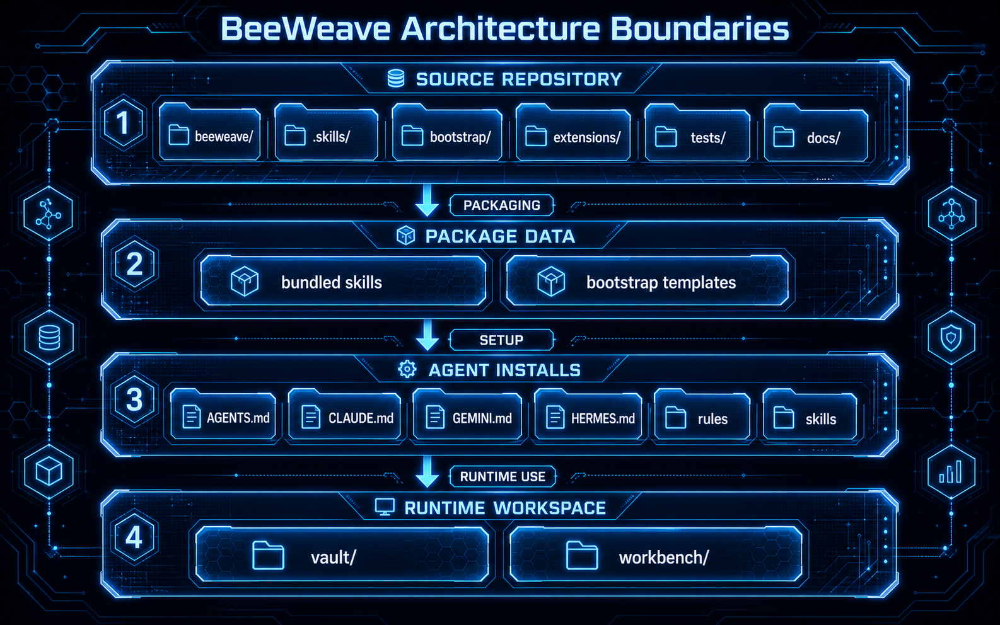

# Architecture

BeeWeave has two important boundaries: repository source files and runtime
workspace files.

## Source Repository

```text
beeweave/       # Python CLI and helpers
.skills/        # source skill definitions
bootstrap/      # agent bootstrap templates
extensions/     # browser extension assets
tests/          # pytest suite
openspec/       # proposed and active changes
docs/           # MkDocs source documentation
```

The Python package provides the `bwe` CLI. The wheel bundles source skills and
bootstrap templates under package data so a package install can set up agents
without a cloned repository.

## Runtime Workspace

Runtime folders are created by `bwe setup` in the user-selected workspace:

```text
project/
+-- vault/                  # durable Markdown knowledge
+-- workbench/              # captures, sources, drafts, and inbox material
```

These folders are user data. They are not source documentation and should not
be committed to the BeeWeave repository root.

## Main Components

- CLI: `beeweave/cli.py` exposes setup, uninstall, info, list, graph, cache,
  batch, and AST helper commands.
- Skills: `.skills/wiki/` and `.skills/workbench/` hold the source skill
  packages installed into agents.
- Bootstrap: `bootstrap/` contains agent rules and instructions copied into
  user workspaces.
- Browser extension: `extensions/brain-capture/` captures selected web content
  into the workbench inbox.
- OpenSpec: `openspec/` records proposed changes before implementation.

## Design Boundary

MkDocs builds this wiki from `docs/` into `site/`. The `site/` directory is a
local build artifact and is deployed from CI to `gh-pages`; it is not maintained
as source on `main`.


