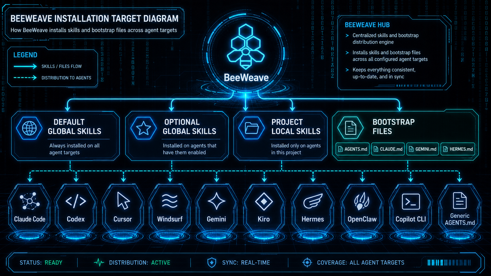

# Agent

BeeWeave 会在 setup 时把共享上下文和 skills 安装到你选择的 Agent。

## 支持目标

```text
claude, cursor, windsurf, generic, pi, kiro, gemini, antigravity,
codex, hermes, openclaw, copilot, trae, trae-cn
```

项目本地 setup 会安装完整 BeeWeave skills 和 bootstrap 文件。全局 setup 保持克制，避免其它项目无意继承完整 BeeWeave 工作台。

## Bootstrap 文件

根据选择的目标，setup 可能写入：

- `AGENTS.md`
- `CLAUDE.md`
- `GEMINI.md`
- `HERMES.md`
- Cursor rules
- Windsurf rules
- Kiro steering
- Antigravity rules 与 workflows
- Copilot instructions

这些文件会告诉 Agent 如何使用同一套 `vault/` 和 `workbench/`，避免上下文困在某一次聊天或某一个工具里。

## 安装策略

- 全局安装：默认 portable skills 和显式选择的高级 skills。
- 项目本地安装：为选中的工作区安装完整 BeeWeave skill 集。
- 运行时数据：在用户工作区创建，不在本仓库创建。

## OpenClaw 软链接配置

BeeWeave 会把 OpenClaw 项目本地 skills 安装到 `.agents/skills`，这与
OpenClaw 官方的 project agent skills 根目录一致。BeeWeave 默认使用软链接，
所以这些目录可能会指向 BeeWeave 安装包里的 skills 数据目录。

OpenClaw 会校验 project-agent skill roots 下软链接的真实目标路径。如果 setup
之后 OpenClaw 没有加载 BeeWeave skills，可以选择其中一种方式：

- 运行 `bwe setup --agents openclaw --copy`，复制 skills，避免软链接限制。
- 保留软链接，并在 `openclaw.json` 的 `skills.load.allowSymlinkTargets`
  中加入 BeeWeave 已安装的 skills 数据目录。

可以把下面这段 Prompt 复制给 OpenClaw，让它在当前项目中解析真实路径并更新配置：

```text
请帮我修复 BeeWeave skills 在 OpenClaw 中无法加载的问题。

背景：
- BeeWeave 已经把 OpenClaw 项目本地 skills 安装到当前项目的 `.agents/skills`。
- 这些 skills 可能是 symlink。
- OpenClaw 需要在 `openclaw.json` 的 `skills.load.allowSymlinkTargets` 中允许项目 skill 根目录之外的 symlink 目标。

请你执行：
1. 检查当前项目 `.agents/skills` 下的 BeeWeave skill symlink。
2. 解析这些 symlink 的真实目标路径。
3. 找到共同的 BeeWeave skills 数据目录。
4. 更新 `openclaw.json`，把该目录加入 `skills.load.allowSymlinkTargets`。

要求：
- 保留所有已有 OpenClaw 配置。
- 如果已有 `skills.load.allowSymlinkTargets`，只追加缺失路径。
- 修改文件前，先展示你准备加入的路径。
```


