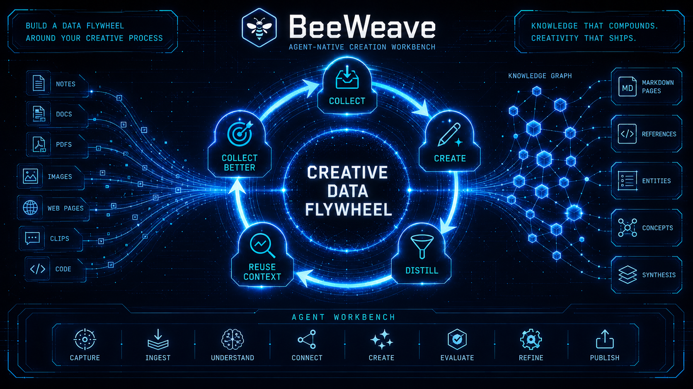

# 数据飞轮

BeeWeave 是一个循环，而不是单向归档。

```text
获取素材 -> 创作 -> 沉淀 -> 复用上下文 -> 获取更好的素材并创作新内容
```

## 1. 获取素材

把原始输入放入 `workbench/`：链接、笔记、PDF、聊天导出、会议记录、截图、产品 brief、源码文件，以及 Agent 会话中的发现。

```text
/beeweave-ingest workbench/inbox
```

## 2. 创作

把 workbench 当作草稿台。写作和 workbench skills 可以把素材转化为文章、短内容、研究笔记、规格说明或项目产出，同时保留原始来源。

## 3. 沉淀

当作品发布或决策稳定后，把高信号结果 ingest 到 vault：

```text
/beeweave-ingest workbench/articles/published
/beeweave-update
```

Vault 应保存长期概念、实体、引用、综合笔记、项目决策和互相关联的 Markdown 页面。

## 4. 复用上下文

下一次任务开始前，先查询 vault，让 Agent 从你已经知道的内容出发：

```text
/beeweave-query what do I know about MCP security?
```

## 5. 获取更好的素材并创作新内容

查询会暴露知识缺口，草稿会暴露薄弱论点，digest 会浮现新主题。用这些信号决定下一轮要收集什么，以及基于这些素材创作什么新内容。


