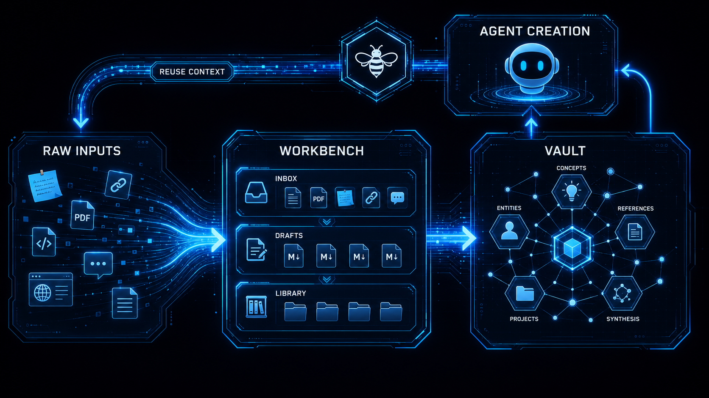

# BeeWeave

BeeWeave 是一个 Agent 原生的创作工作台，用来围绕创作过程构建数据飞轮：获取素材，用 Agent 辅助创作，把关键内容沉淀成长期知识，复用这些上下文，再指导下一轮获取更好的素材并创作新内容。


```text
获取素材 -> 创作 -> 沉淀 -> 复用上下文 -> 获取更好的素材并创作新内容
```

## BeeWeave 提供什么

- `workbench/`：存放粗糙输入、捕获内容、资料和草稿。
- `vault/`：存放可搜索、可链接、可复用的长期 Markdown 知识。
- 共享 skills：处理素材 ingest、知识查询和项目上下文同步。
- 多 Agent bootstrap：让不同 Agent 使用同一套知识系统。

BeeWeave 不只是“给 Agent 加记忆”，而是一套把素材和成果持续转化为可复用上下文的工作流。

## 从这里开始

- 在[快速开始](quickstart.md)里完成安装和初始化。
- 在[架构](architecture.md)里理解源码、运行时目录和构建产物边界。
- 在[数据飞轮](flywheel.md)里理解完整循环。
- 在[Agent](agents.md)里查看支持的安装目标。

## 文档站点


