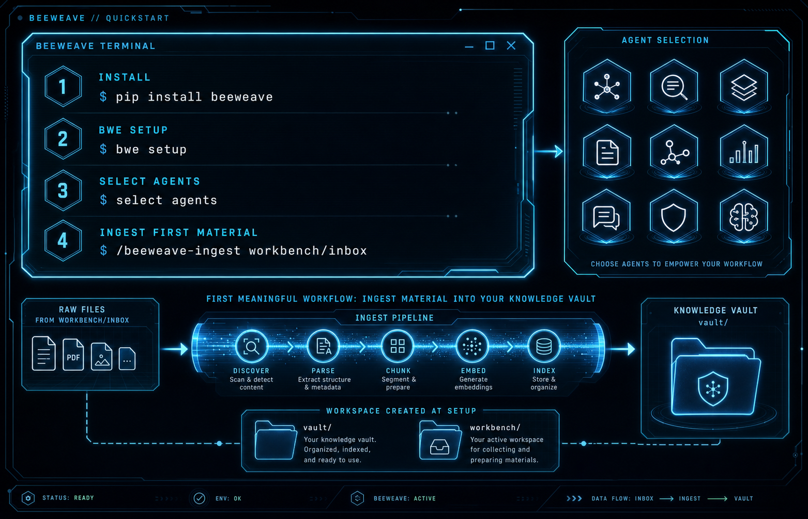

# 快速开始

在需要使用 `bwe` CLI 的环境里安装 BeeWeave：

```bash
pip install beeweave
```

然后在你希望 BeeWeave 创建运行时目录的工作区里执行：

```bash
bwe setup
```

`bwe setup` 会在当前工作区创建 `vault/` 和 `workbench/`，把全局配置写入
`~/.beeweave/config`，并为你选择的 Agent 安装 skills 与 bootstrap 文件。

## 常用命令

```bash
bwe info
bwe list
bwe setup --agents claude,codex
bwe setup --global-extra beeweave-capture,beeweave-status
bwe uninstall
```

`bwe uninstall` 会移除 BeeWeave 管理的 skills、bootstrap 文件和
`~/.beeweave` 配置，但不会删除你的 `vault/` 或 `workbench/` 内容。

## 使用 skills

Setup 完成后，在支持的 Agent 中直接使用：

```text
/beeweave-ingest workbench/inbox
/beeweave-query what do I know about rate limiting?
/beeweave-update
```

## 源码仓库开发安装

如果你在修改 BeeWeave 本仓库，而不是普通使用 PyPI 包，可以执行：

```bash
bash setup.sh
uv run bwe info
```

源码 checkout 适合开发；普通用户安装优先使用 `pip install beeweave`。


